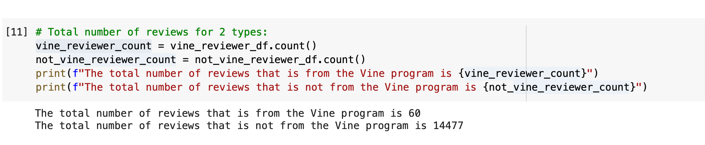
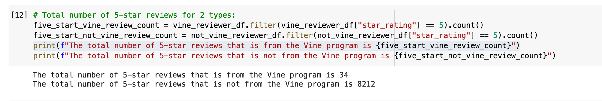
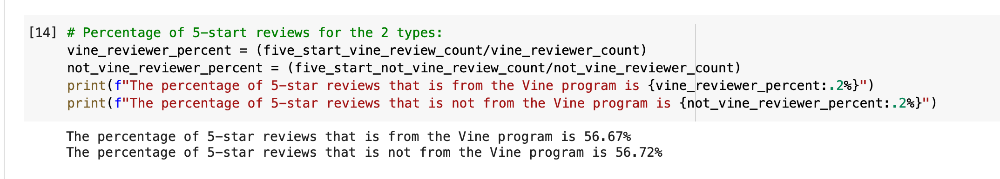

# Amazon_Vine_Analysis

## Overview:

In this project, I helped a company called SellBy to analyze Amazon reviews written by members of the paid Amazon Vine program. The Amazon Vine program is a service that allows manufacturers and publishers to receive reviews for their products. Companies like SellBy pay a small fee to Amazon and provide products to Amazon Vine members, who are then required to publish a review.

I chose the Musical Instrument dataset for the analysis. To do so, I used PySpark to perform the ETL process to extract the dataset, transform the data, connect to an AWS RDS instance, and load the transformed data into pgAdmin. Next, I used PySpark and Pandas to determine if there is any bias toward favorable reviews from Vine members in my dataset. 

## Tools:

- PySpark
- PostgreSQL
- Amazon AWS
- Google Colaboratory ( to produce .ipnynb files_

## Results:

- How many Vine reviews and non-Vine reviews were there?
  - There are 60 Vine reviews and 14477 non-Vine reviews in my dataset.
  
- How many Vine reviews were 5 stars? How many non-Vine reviews were 5 stars?
  - There are 34 5-star reviews that come from the Vine program, and 8212 5-star reviews that come from the non-Vine program.
  
- What percentage of Vine reviews were 5 stars? What percentage of non-Vine reviews were 5 stars?
  - The percentage is 56.67% for the Vine reviews and 56.72% for the non-Vine reviews.
  
## Summary:

Seeing the percentage number between the two groups, I do not see any positivity bias for reviews in the Vine Program. The percentage number is really close, only 0.05. This also shows that receiving a review from the Vine program participant does not guarantee a 100 #5-star review, which is great for the unbiased aspect of the reviews.

For my future analysis, I would like to do the average star reviews of each item for the two groups. This will let us know the actual unbiased aspect of the reviews or the program.
